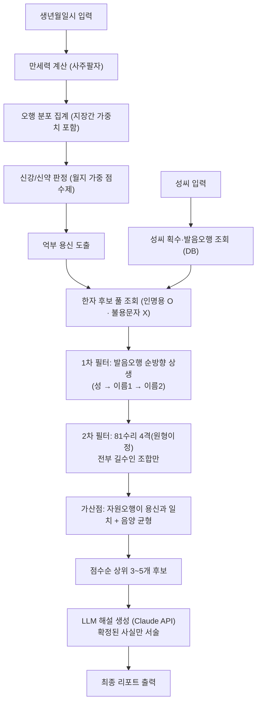

# 유어네임 (yourname)

사주 분석 기반의 AI 정통작명 서비스. 유명 작명원에 가지 않아도 집에서 높은 품질의 작명(사주 분석 → 용신 도출 → 이름 후보)을 받아볼 수 있게 하는 것이 목표다.

> 도메인 규칙(학파 결정, 데이터 출처, 각 단계에서 왜 그렇게 결정했는지)의 단일 기준 문서는 **[`CLAUDE.md`](./CLAUDE.md)**다. 이 README는 그 내용을 처음 보는 사람이 빠르게 이해할 수 있도록 개념적으로 요약한 것이고, 규칙이 바뀌면 `CLAUDE.md`가 먼저 바뀌고 이 문서는 그 뒤를 따른다.

---

## 1. 핵심 사용자 흐름

```
생년월일시 + 성별 + 성씨 입력
        ↓
사주 분석 (만세력 → 팔자 → 오행 분포 → 신강/신약 → 용신)
        ↓
이름 후보 생성 (발음오행 상생 + 81수리 길흉 + 자원오행/음양 가산점)
        ↓
이름 후보 3~5개 + 근거 리포트 출력 (LLM이 자연어로 해설)
```

---

## 2. 설계 철학 — 결정적 계층 vs 해석적 계층

이 서비스의 정확성은 **"무엇을 코드로 계산하고, 무엇을 LLM에 맡기는가"**의 경계를 지키는 데 달려 있다. LLM에게 계산을 맡기면 환각(hallucination)이 발생하므로, 숫자·판정이 필요한 모든 단계는 순수 함수/DB 조회로 처리하고 LLM은 마지막에 "이미 확정된 사실을 서술"하는 역할만 한다.

| 계층 | 내용 | 담당 |
|---|---|---|
| **결정적 계층** | 만세력 계산, 오행 분포 산출, 한자 획수, 수리사격·81수리 판정, 발음오행 상생 판정, 인명용 한자/불용문자 필터 | 순수 함수 + DB 조회 (`lib/naming/`, `lib/db.ts`) |
| **해석적 계층 (규칙)** | 신강/신약 판정, 용신 도출, 후보 필터링·점수화 | 명시적 규칙 엔진 (`lib/naming/yongsin.ts`, `candidates.ts`) — 학파 입장을 코드로 고정 |
| **해석적 계층 (LLM)** | 확정된 후보의 자연어 해설, 후보 간 미묘한 어감 비교 | Claude API — 새로운 수치나 판정을 만들어내지 않음 |

LLM은 사주를 세우지 않고, 획수를 세지 않고, 오행·용신·인명용 여부를 판단하지 않는다. 이 물리적 경계는 `lib/naming/` 폴더가 Next.js·Turso·Anthropic SDK 어느 것도 import하지 않는다는 규칙(8장 참고)으로 코드 구조상 강제된다.

---

## 3. 작명 로직 파이프라인 (개념도)



각 단계의 정확한 판정 기준(예: 발음오행 배속표, 원획 기준, 억부용신 로직)은 `CLAUDE.md` 3장을 참고.

---

## 4. 개발 단계별 구성 (로드맵 + 단계별 기술스택)

| Phase | 내용 | 주요 기술스택 | 상태 |
|---|---|---|---|
| **1. 뼈대 + 배포** | Next.js 프로젝트 생성, Vercel 자동 배포 파이프라인 구축 | Next.js(App Router), TypeScript, Vercel | ✅ 완료 |
| **2. 사주 엔진** | 생년월일시 → 팔자 → 오행분포 → 신강약 → 용신을 순수 함수로 구현 | `@fullstackfamily/manseryeok`(만세력), TypeScript, `vitest`(단위 테스트) | ✅ 완료 |
| **3. 참조 데이터** | 한자·성씨·81수리 사전 데이터를 실제 DB에 구축 | Turso(libSQL/SQLite), `@libsql/client`, Node 스크립트(`scripts/db/`) | ✅ 완료 |
| **4. 작명 엔진** | 용신 + 성씨 제약으로 후보 조합을 생성하는 파이프라인 조립 | `lib/naming/` 순수 함수(발음오행·수리·자원오행·음양 필터링/점수화), Next.js API Route | ✅ 완료 |
| **5. LLM 설명 계층** | 확정된 후보를 자연어로 해설, 후보 큐레이션 | Claude API(`@anthropic-ai/sdk`) | ⬜ 예정 |
| **6. 프론트/UX + 마무리** | 입력 폼, 결과 리포트 디자인, 법적 고지 | Next.js(React), Tailwind CSS | ⬜ 예정 |

전체 기술 스택 표는 `CLAUDE.md` 1장 참고.

---

## 5. DB 스키마 구조 (Turso)

참조 데이터는 3개 테이블로 구성되며, 작명 파이프라인은 이 테이블들을 조회만 하고 직접 계산하지 않는다 (계산 결과가 이미 컬럼에 정적으로 적재되어 있음).

### `hanja` — 한자 사전 (현재 9,063자 적재)

이름 후보의 재료가 되는 한자 전체와, 각 한자에 대한 판정 결과를 담는다.

| 컬럼 | 타입 | 설명 |
|---|---|---|
| `char` | TEXT | 한자 (유니코드) |
| `readings` | TEXT | 인명용 대표음(들), JSON 배열. `[0]`을 대표음으로 취급 |
| `stroke_original` | INTEGER | **원획** — 수리사격 계산에 사용 (부수를 원형 기준으로 계산) |
| `stroke_actual` | INTEGER | 필획 (참고용, 실제 표기 획수) |
| `radical` | TEXT | 부수 (강희자전 214부수 대표자) |
| `element` | TEXT | 자원오행(木/火/土/金/水). 부수 의미가 명확한 18개 부수만 배속된 **영구적 부분표**라 약 33%는 `NULL` |
| `meaning` | TEXT | 뜻풀이 |
| `is_name_allowed` | INTEGER | 인명용 한자 여부 (가족관계등록규칙 제37조 기준) |
| `is_forbidden` | INTEGER | 불용문자(뜻·기운이 이름에 부적합) 여부 |
| `forbidden_reason` | TEXT | 불용 사유 (nullable) |
| `verification_status` | TEXT | `confirmed`/`unverified` — 데이터 출처 교차검증 상태 |

### `surname` — 성씨 (현재 상위 30개 적재)

| 컬럼 | 타입 | 설명 |
|---|---|---|
| `hangul` | TEXT | 한글 성 (예: 김) |
| `hanja` | TEXT | 한자 성 (예: 金) |
| `stroke_original` | INTEGER | 성씨 원획 |
| `initial_element` | TEXT | 초성 발음오행 (성의 첫 글자 발음이 어떤 오행인지 — 이름 글자의 발음오행 상생 체인의 출발점) |

### `numerology_81` — 81수리 길흉표 (1~81 전체 적재)

| 컬럼 | 타입 | 설명 |
|---|---|---|
| `number` | INTEGER (PK) | 1~81 |
| `fortune` | TEXT | `길`/`흉`/`반길` — 후보 필터링의 하드 기준 (반길도 흉과 함께 탈락 처리) |
| `title` | TEXT | 수리 명칭 |
| `description` | TEXT | 해설 (LLM 리포트에 인용) |

데이터 출처·적재 과정의 한계(제외된 희귀 한자, 자원오행 부분표인 이유 등)는 `CLAUDE.md` 3.5절과 4장을 참고.

---

## 6. 코드 구조 원칙

**계산 로직(순수 함수)은 `lib/naming/` 한 곳에 몰아넣고, 이 폴더는 Next.js·Turso·LLM SDK 어떤 것도 import하지 않는다.**

```
yourname/
├─ lib/
│  ├─ naming/            ← 순수 로직. 외부 import 금지. 프로젝트의 핵심.
│  │  ├─ config.ts       ← 학파 설정 상수 (발음오행표, 원획 기준, 억부용신 임계값 등)
│  │  ├─ types.ts        ← Saju, Element, Hanja, Candidate 등 타입
│  │  ├─ phonetic.ts     ← 발음오행: 초성→오행, 상생 판정
│  │  ├─ numerology.ts   ← 수리사격 계산, 81수리 길흉 판정
│  │  ├─ elements.ts     ← 팔자 → 오행 분포 집계
│  │  ├─ yongsin.ts      ← 신강약 판정 + 억부 용신 도출 (규칙 엔진)
│  │  └─ candidates.ts   ← 후보 조합 생성 (필터링 + 점수화)
│  ├─ saju.ts             ← 만세력 라이브러리를 감싸 Saju 타입 반환
│  └─ db.ts                ← Turso 접속 + 조회 함수 (한자·성씨·수리)
│
├─ scripts/db/            ← 스키마 적용 + 참조 데이터 적재 스크립트 (1회성, Next 앱과 무관)
│
└─ app/api/name/route.ts  ← saju·db·naming 순서로 호출해 파이프라인을 조립. 계산 로직 없음.
```

이렇게 나누는 이유: 작명 규칙(원획 계산, 발음오행 상생, 81수리 조합, 용신 도출)은 미묘해서 사람이 눈으로 검수하기 어렵다. 순수 함수로 격리해야 "특정 사주 → 특정 용신/후보"를 테스트 코드로 못박아 검증할 수 있고, 동시에 이 폴더가 LLM을 import하지 않으므로 구조적으로 LLM이 계산에 개입할 방법이 사라진다.

---

## 7. 개발 환경 실행

```bash
npm install
npm run dev       # http://localhost:3000
npm run test      # vitest — lib/naming/ 순수 함수 단위 테스트
```

Turso DB 접속 정보는 `.env.local`에 `TURSO_DATABASE_URL`, `TURSO_AUTH_TOKEN`으로 설정한다 (`.env.local.example` 참고, git에는 커밋하지 않음).

---

## 8. 법적·윤리적 주의

작명 결과는 참고용이며, 실제 출생신고 가능 여부(인명용 한자·독음)는 관할 확인이 필요하다. 사주·작명은 문화적·전통적 관점이며 과학적 예측이 아니다.
